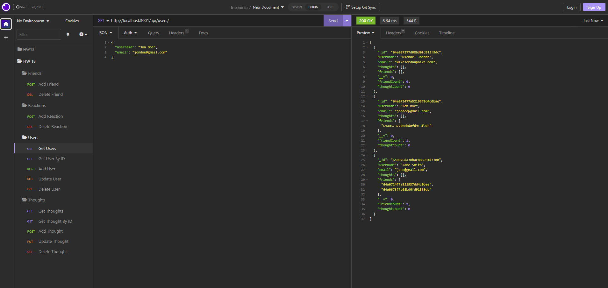

# HW-Challenge-18-Social-Network-API

## Description

As a social media startup I want an API for my social network that uses a NoSQL database so that my website can handle large amounts of unstructured data

## Main Objectives

- When I enter the command to invoke the application, my server is started and the Mongoose models are synced to the MongoDB database
- When I open API GET routes in Insomnia for users and thoughts, the data for each of these routes is displayed in a formatted JSON
- When I test API POST, PUT, and DELETE routes in Insomnia, I am able to successfully create, update, and delete users and thoughts in my database
- When I test API POST and DELETE routes in Insomnia, I am able to successfully create and delete reactions to thoughts and add and remove friends to a user’s friend list

## Links

Walkthrough Video: 

Repo: https://github.com/pg1219/HW-Challenge-18-Social-Network-API

## Mock-Up

Preview image of deployed application

